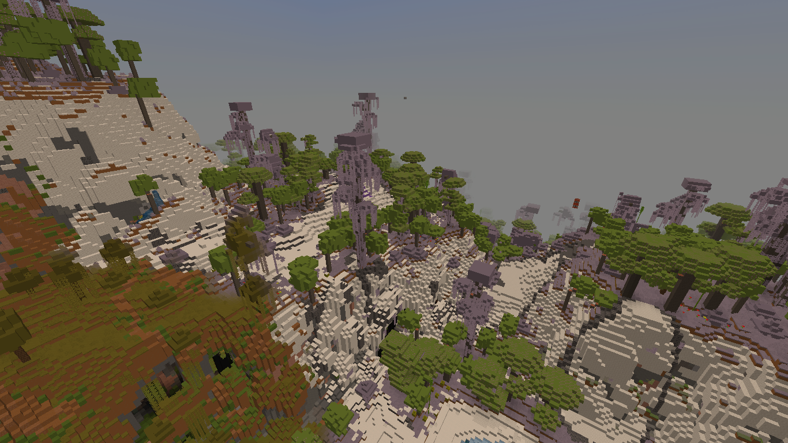

# 🚀 Fitur unik

🥏<strong>Elevator</strong>

Elevator bisa dibuat dengan shulker box, chest, dan beberapa wool. Elevator bisa digunakan dengan keybind, Jump(keatas) dan Sneak(kebawah). Recipe Elevator bisa di cari di Crafting table.

🕊TempFly

TempFly atau Temporary Fly adalah fitur gratis yang bisa diakses semua rank di destaria, namun rank rank standar ada batas waktu untuk waktu terbangnya, semakin bagus rank nya semakin tinggi batas waktu nya, tidak seperti server lain yang butuh bayar dulu agar bisa terbang. <mark style="color:blue;">**/fly**</mark>

🌎Custom World Generation

Tahukah kamu bahwa DestariaMc adalah SATU satunya server indonesia yang menggunakan Custom world generator? ini artinya destaria bisa membuat biome biome unik dan structure sctructure secara otomatis dan alami

🚪BigDoors

Dengan Fitur ini, kamu dapat mengcustom Pintu mu! kamu dapat membuka dan mentutup pintu dengan animasi yang keren! Hampir tidak ada server lain yang mempunyai Fitur seperti ini, Dengan adanya fitur ini kamu dapat membuat jalan rahasia yang hanya kamu sendiri bisa buka lewat <mark style="color:blue;">**/bdm**</mark>

🛡 RedProtect

RedProtect atau biasa dipanggil rp adalah fitur yang digunakan untuk ngeclaim area yang sudah ditentukan untuk membuat area yang sudah di claim tidak bisa dihancurkan oleh player lain yang belum di add member di dalam area claim tersebut.\
Jika kamu masih bingung gimana cara untuk ngeclaim rp, kamu bisa ketik <mark style="color:blue;">**/caraclaim**</mark> atau <mark style="color:blue;">**/warp tutorial**</mark> di chat.

🎭Nickname

Seperti namanya, fitur ini memperbolehkan kamu untuk men-Disguise nickname minecraft kamu menjadi nama yang kamu mau <mark style="color:blue;">**/nick**</mark> (Donatur+ Rank)

🔥Temperature

Temperature bisa dilihat di scoreboard mu. Temp bisa dipengaruh oleh biome, dan block. \
Jika Temperature mu terlalu tinggi kamu bisa saja mendapatkan Effect slowness 1 sampai slowness 3, jika kamu di dessert kamu bisa sampai terbakar jika terlalu lama di temperature tinggi.\
Jika Temperature mu terlalu rendah, kamu bisa terkena effect beku dan memperlambat jalanmu, kamu juga bisa terkena effect hunger.

💼ChestLink

Seperti namanya, fitur ChestLink merupakan fitur yang dapat memudahkan penggunanya saat menyimpan barang di Chest dengan cara menghubungkan isi Chest dengan Chest lainnya. \
\
<mark style="color:blue;">**(/chestlink help untuk mengetahui lebih lanjut)**</mark>

⏱️AutoCraft

Fitur AutoCraft merupakan fitur yang dapat digunakan bersamaan dengan ChestLink. Fitur AutoCraft sendiri digunakan untuk mengcraft suatu barang dengan cepat / auto. Fitur ini hanya dapat digunakan oleh rank Ksatria, Bahaduri, dan rank- rank seterusnya.\
\
<mark style="color:blue;">**(/autochest help untuk mengetahui lebih lanjut)**</mark>\

