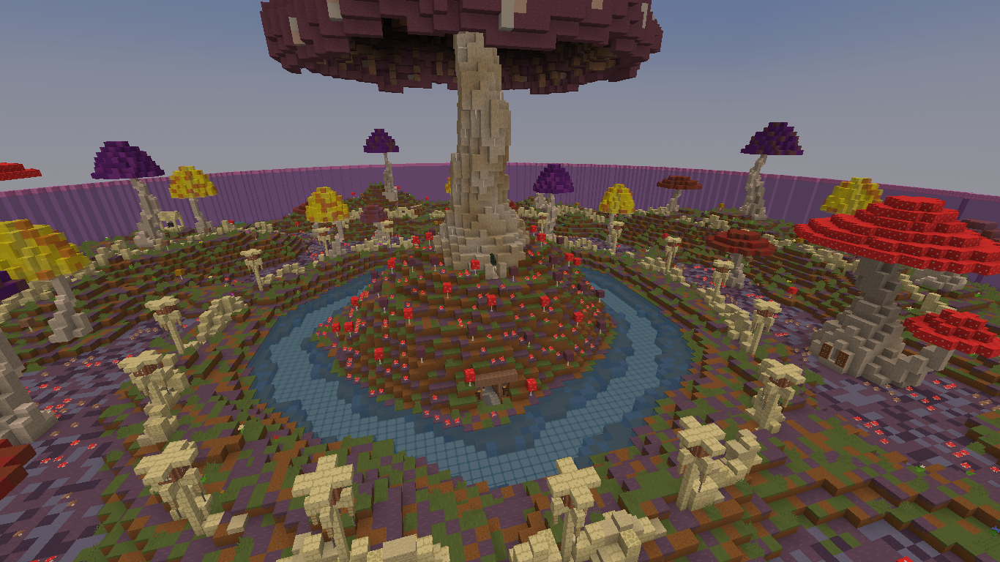

# Warps

Warp adalah fitur teleportasi yang sangat berguna untuk member dan staff, karena memudahkan berpindah tempat, karena alasan itu lah Warp dibuat, dan dibawah ini adalah List Warps yang ada di DestariaMc&#x20;

Tutorial

Warp Tutorial adalah Warp yang memperlihatkan video Tutorial untuk fitur RedProtect <mark style="color:blue;">**/warp tutorial**</mark> . atau kalau mau lebih simpel tinggal ketik <mark style="color:blue;">**/caraclaim**</mark>

Parkour Maze

Warp Parkour Maze adalah Warp minigame kecil kecilan yang dibuat oleh beberapa staff <mark style="color:blue;">**/warp Parkour\_maze**</mark>

Arena

Seperti namanya, Warp Arena adalah sebuah tempat dimana kamu bisa pvp menggunakan kits yang disediakan oleh staff, Arena terletak di Flatroom jadi Inventory yang ada di survival dan arena berbeda <mark style="color:blue;">**/warp arena**</mark>

Gacha

Seperti namanya, Warp gacha adalah tempat di spawn/lobby yang bisa digunakan untuk gacha key, entah Vote key atau key key lainnya <mark style="color:blue;">**/warp gacha**</mark>

.png>)

Spawn

Seperti namanya, Warp Spawn adalah tempat Gacha dan warp untuk pergi World Survival atau World Reso <mark style="color:blue;">**/warp spawn**</mark>

Reso

Warp Reso atau Resource World adalah warp yang bertujuan ke Resource World, untuk informasi tentang World sudah dijelaskan di Main Page <mark style="color:blue;">**/warp reso**</mark>

Survival

Warp survival sama halnya dengan warp reso, warp yang bertujuan untuk pindah ke world yang ada di namanya, warp survival cocok untuk dibuat base, untuk informasi tentang World sudah dijelaskan di Main Page <mark style="color:blue;">**/warp survival**</mark>

Pabji

Warp Pabji adalah Tempat yang ada di Flatroom seperi Arena, namun bedanya adalah Warp pabji pvp menggunakan senjata. <mark style="color:blue;">**/warp pabji**</mark>

Rules

Warp rules adalah warp yang memperlihatkan Rules yang berlaku di Destaria (ingame), untuk rules yang lengkap bisa di baca di discord Destaria! <mark style="color:blue;">**/warp rules**</mark>

